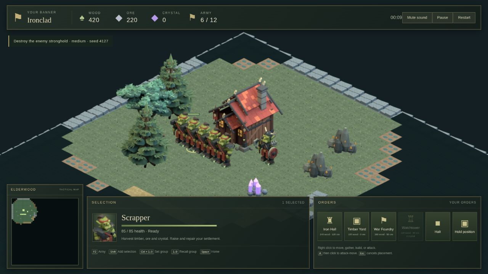
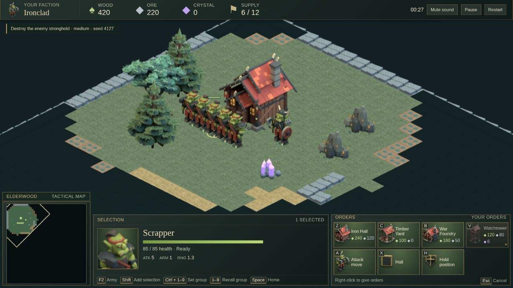
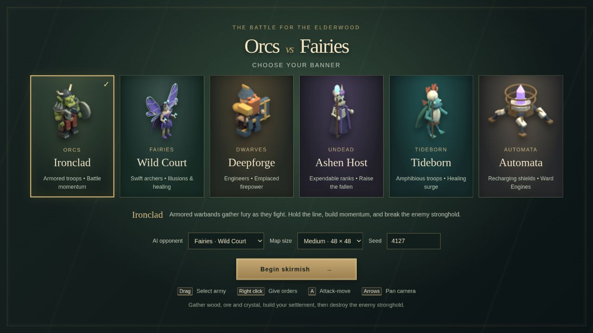

# RTS interface overhaul

The game now uses an illustrated command bar, large selection portraits and a thin resource strip. All six banners fit on one faction-selection screen at 1280 × 720. The local production build is playable at [127.0.0.1:4173](http://127.0.0.1:4173); run `npm run build` and `npm run preview -- --port 4173` to restart it.

## Before and after

The original source is commit `b1e9ca874d7a3ec073c4f29dca1b0424b966eac9`. Both worker screenshots show the Orc opening on the default medium map, seed 4127.

Before:

After:

The [original faction menu](evidence/ui-overhaul/before-menu-1280.png) used description-heavy cards. The new menu gives each faction an artwork banner, a short trait line and a shared description for the selected faction.

The [1920 × 1080 worker view](evidence/ui-overhaul/after-worker-1920.png) and [larger menu](evidence/ui-overhaul/after-menu-1920.png) show the final layout at the second tested size.

## What changed

A single selection uses a 102-pixel square portrait, up from the old 64 × 74 box. Groups show combined health and clickable portraits with individual health bars. Ctrl+1–9 still assigns groups, and numbered buttons recall them. Construction has its own gold progress bar. Recruitment shows portraits, queue order, progress and seconds remaining, including queues from multiple selected producers. Large rosters and queues scroll horizontally.

Commands use existing Blender building and unit artwork. New Halt and Hold position icons were modeled and rendered in Blender; editable scenes and the rendering script are included. An [ImageGen reference](../art/reference/rts-ui-command-bar.png) guided the layout before those assets were made. The reference image is not shipped as interface artwork.

Construction, recruitment and abilities show costs and keyboard shortcuts. Unavailable commands remain focusable so their tooltips can explain missing resources, reserved supply, a full queue, construction, cooldowns or missing ability targets. Mixed worker/building selections have Build and Recruit tabs. Existing keyboard and mouse controls remain, with Z/C/B/V added for the displayed build slots and Z/C/B for recruitment.

The minimap is 200 × 200 at 1280 and 220 × 220 at 1920, compared with 176 × 176 before. Its outlined camera region follows the usable battlefield band. Space and minimap clicks center the destination between the resource strip and command bar.

The final footer is 190 pixels high, with the minimap extending above it and transparent gaps between panels. Measured persistent HUD coverage fell from 35.45% to 33.12% at 1280 × 720, leaving 21,451 more battlefield pixels. At 1920 × 1080 it fell from 16.65% to 16.20%, leaving 9,281 more pixels. These are unions of rendered panel rectangles, including the objective and minimap title; shadows and temporary tooltips/notices are excluded. The original and final DOM measurements and calculation are in [coverage-comparison.json](evidence/ui-overhaul/coverage-comparison.json), reproducible with `python3 scripts/measure_ui_coverage.py`.

## Browser verification

Playtesting used normal browser input. Read-only telemetry records match state every five seconds; it does not issue orders. The [session summary](evidence/ui-overhaul/browser-summary.json) describes what that telemetry can prove. UI snapshots and screenshots separately show commands, artwork and tooltip state.

| Requirement | Browser evidence |
| --- | --- |
| Economy, construction and completed match | Orc game ended in defeat at 6:39. Wood, ore and crystal gathering, a depot, barracks, worker and military recruitment and War Cry were exercised. [Trace](evidence/ui-overhaul/first-match.jsonl), [result](evidence/ui-overhaul/first-match-defeat-1280.png). |
| Automata economy and completed match | Defeat at 6:05, with all three resources gathered, depot and barracks completed, all four unit roles recruited, a three-item queue and shield restoration recorded. [Trace](evidence/ui-overhaul/automata-match.jsonl), [result](evidence/ui-overhaul/automata-match-defeat-1280.png). |
| Final portraits, costs and unavailable tooltip | [1280 worker](evidence/ui-overhaul/after-worker-1280.json), [1920 worker](evidence/ui-overhaul/after-worker-1920.json), [crystal requirement tooltip](evidence/ui-overhaul/final-tooltip-1280.png). |
| Final queues and mixed groups | [1920 queue](evidence/ui-overhaul/final-queue-1920.json), [1280 mixed selection](evidence/ui-overhaul/final-mixed-1280.png), [1920 mixed selection](evidence/ui-overhaul/final-mixed-1920.png). Build/Recruit switching was exercised. |
| Construction progress | [Automata construction](evidence/ui-overhaul/construction-progress-1280.png). |
| Fairies | Worker commands, recruitment and Veilweaver illusion cooldown. [Production](evidence/ui-overhaul/fairies-production.json), [ability](evidence/ui-overhaul/fairies-ability-1280.png). |
| Dwarves | Worker commands, cannon recruitment, emplacement and saved-group recall. [Worker](evidence/ui-overhaul/dwarves-worker.json), [group recall](evidence/ui-overhaul/dwarves-group-recall.json). |
| Undead | Worker commands, Gravecaller production and the no-usable-corpses explanation. [Production](evidence/ui-overhaul/undead-production.json), [unavailable ability](evidence/ui-overhaul/undead-no-target-1280.png). |
| Tideborn | Worker commands, recruitment and Tidecaller healing surge/cooldown. [Production](evidence/ui-overhaul/tideborn-production.json), [surge](evidence/ui-overhaul/tideborn-surge-1920.png). |
| Automata ability targets | [Full-shields explanation](evidence/ui-overhaul/automata-full-shields-1280.png); later restoration is recorded in the completed-match trace. |
| Map settings | A new Dwarf game against Tideborn started on a large map with seed 9876. [Recorded state](evidence/ui-overhaul/large-map-settings.json). |

The two complete games and faction-specific screenshots were collected during the UI refinements. Files named `after-worker`, `after-menu`, `final-*` and the coverage measurements show the final compact CSS. Earlier faction screenshots verify their controls and artwork, rather than the final panel dimensions. The final compact build was then exercised with recruitment and mixed selections at both resolutions.

## Checks and remaining limits

`npm test` passed all 182 tests across nine files; `npm run build` and `git diff --check` passed. Three new tests compare ability-target explanations with accepted or rejected simulation commands. The [test log](evidence/ui-overhaul/tests-final.log), [build log](evidence/ui-overhaul/build-final.log) and [art check](evidence/ui-overhaul/art-check.json) are saved. The art check inspected all 56 UI images for dimensions, visible pixels and transparency; browser snapshots also checked that visible portraits loaded.

A byte comparison against the baseline confirmed that all 227 tracked core simulation and existing asset files are unchanged. [Preservation result](evidence/ui-overhaul/preserved-gameplay.json). Gameplay, faction balance, map generation and the CLI were not redesigned.

No missing artwork or broken faction control was found in these checks. This was desktop testing in the local Chromium browser at 1280 × 720 and 1920 × 1080; smaller/mobile layouts and other browsers are not verified. The completed playtests ended in defeat and do not establish faction balance. Existing gameplay limits remain documented in [KNOWN_LIMITATIONS.md](KNOWN_LIMITATIONS.md). Long mixed-production queues may require horizontal scrolling.

The local decision trail is `work/ui-overhaul/decisions.tsv`. A GPT-5.6 Sol reviewer caught a grid sizing error during the final footprint change; the fixed row size was rechecked in a fresh browser render before these captures.

Final review by GPT-5.6 Sol (medium reasoning) found no remaining UI blocker. One historical server-recovery observation lacks separately archived proof; the audit trail explicitly qualifies that claim. Later final browser snapshots independently verify image loading.
