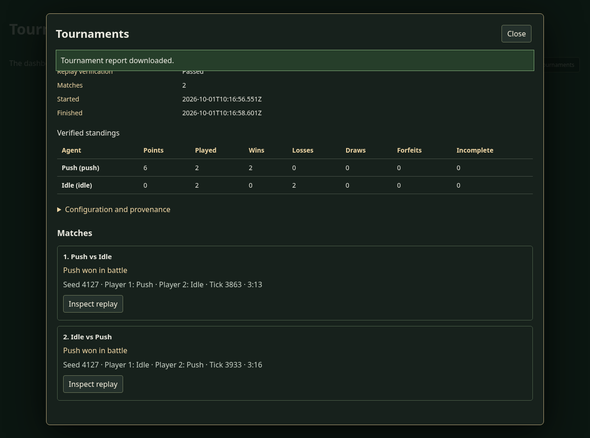
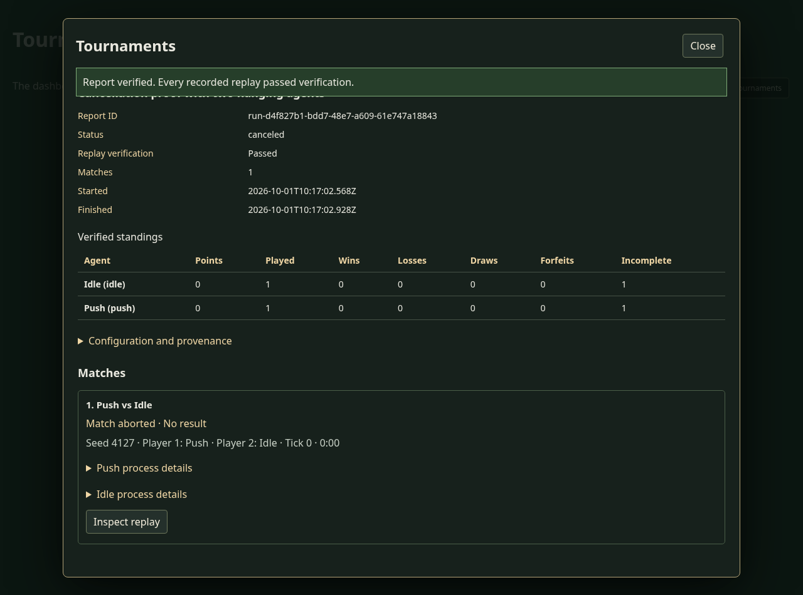

# Agent tournament service and dashboard proof

The assembled tournament code at `058cc8f` ran the displayed dashboard against the real HTTP service in Node v24.21.0 and Chromium 151.0.7922.34. `summary.json` records nine passing integration checks and pins the Node bundle, browser bundle, stylesheet and bytes fetched by the browser. Compressed copies of those bundles and both reports are retained here. `artifact-sha256.json` pins all captured files other than this README.

The dashboard started the registered smoke configuration, polled progress and standings, downloaded the verified report and inspected both replays in the browser. Both games ended as battle victories for Push, at ticks 3863 and 3933. The replay callback compared the full final state, sought to the midpoint and returned to the same final state. The replay HTTP response matched the report. Unauthorized requests and attempts to provide executable commands through HTTP were rejected.

The cancellation run started two hanging agents. PIDs 1225019 and 1225020 were observed alive before the displayed Stop tournament control requested cancellation. The canceled report recorded those same PIDs, both had exited, and no marked agent processes remained. The canceled partial report verified in Node and Chrome. `cleanup.json` records that the browser and HTTP server closed and no agent processes survived.

`focused-tests.log` records 87 passing tests across the tournament runtime, dashboard, planning session, replay and numeric helper suites. This includes final-turn duplicate responses, shutdown while awaiting authorization or a streamed request body, cleanup after a throwing progress callback, and dashboard recovery after rejected content or replay verification. `typescript.log` records a successful whole-project typecheck. The separate [numeric replay evidence](../deterministic-replay/README.md) contains every-tick hashes for both complete battles, saved continuations and forward/backward checkpoint seeks.

To repeat the service and browser proof, run the following from the repository root with an installed Playwright module and a new output directory:

```sh
OVF_PLAYWRIGHT_MODULE=/absolute/path/to/playwright/index.mjs \
  node scripts/tournaments/verify-dashboard-service.mjs /tmp/ovf-new-dashboard-proof
```

The script uses Linux `/proc` to identify the live agent processes. This fixture mounts the reusable handler and dashboard with its own cookie authorization callback. The canonical application's router, account authorization and replay installation must be supplied by the host as described in [Agent tournaments](../../AGENT_TOURNAMENTS.md).




