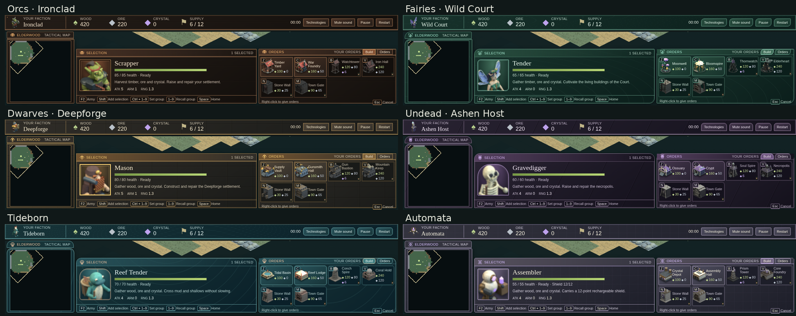

# Faction chrome verification

The comparison combines the resource strip and lower HUD from six separate matches at 1280 × 720, each with a worker selected. Every faction has its own panel texture, fittings, portrait frame and SVG insignia.

The production build was checked in Chromium 153.0.8010.12 at 1280 × 720 and 1920 × 1080. Each faction was chosen in the menu, played, then restarted into the next faction on the same page. Checks covered worker commands, unavailable-command tooltips, the technology dialog, pause/resume, neutral menu restoration and all six insignia loading. Panel bounds and computed styles are recorded in [browser-results.json](browser-results.json). All six backgrounds differed; health, wood and ore colors matched across factions. No page errors or failed HTTP responses were recorded.

A separate Fairy match exercised headquarters recruitment, a mixed worker/headquarters selection and Ctrl+1 group assignment. The selection label ended at x=309.86 and the saved group began at x=323, confirming that the label and group did not overlap. The Build, Recruit and Orders tabs fit inside the command panel.

To inspect the themes, run `npm run build` and `npm run preview -- --port 4175 --strictPort`, then open `http://127.0.0.1:4175/`. Choose a faction, begin a match and select a worker. Focus an unavailable command to inspect its tooltip, open Technologies, pause/resume, and restart to choose another faction. Repeat at both desktop sizes. Mobile layouts and other browsers were not verified.

`npm test` passed the 249 existing tests. The focused HUD suites passed 18 tests, including the 10 new faction lifecycle tests. `npm run build` and `git diff --check` passed.
